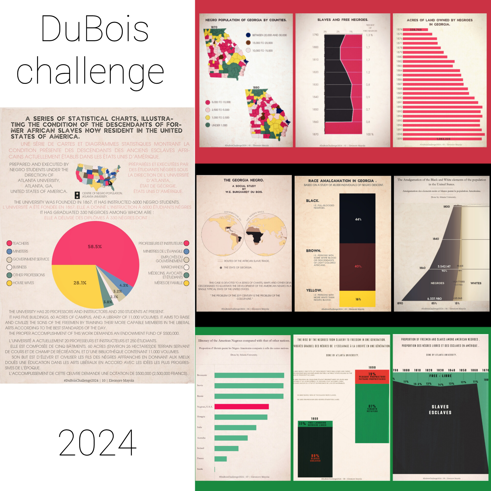

# #DuBoisChallenge2024

[See details](https://github.com/ajstarks/dubois-data-portraits/tree/master/challenge/2024) for the 2024 challenge organised by Anthony Starks in collaboration with the [Data Visualization Society](https://www.datavisualizationsociety.org/).

There was a total of 10 weekly challenges between February 5 and April 8 2024.
"This year the theme for the challenge will be organized around the colors of the Pan African flag: Challenges 1-3: red, Challenges 4-6: black, Challenges 7-9: green, Challenge 10: a combination."

I shared my contributions on Twitter, [Bluesky](https://bsky.app/profile/eleonore.bsky.social/post/3kl3bi3vwqn2z) and IG.

Find Anthony Starks' retrospective for this year 👉🏿 [here](https://speakerdeck.com/ajstarks/du-bois-challenge-2024-recap).

