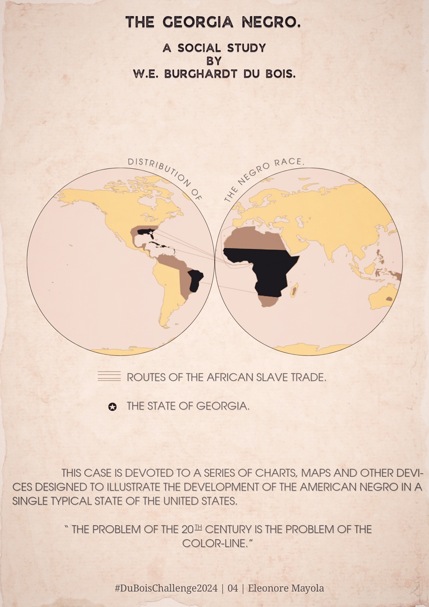

# #DuBoisChallenge2024 - Challenge 04
### The Georgia Negro (plate 01), February 26

For this one I struggled with projections, and my notebook contain all my process. Sorry for the mess 😔

Note: I used data from Madison Giammaria ([repo](https://github.com/Giammaria/Du-Bois-DVS-challenge/tree/main/2024/challenge-04/data))

My contribution made with python and Canva:

