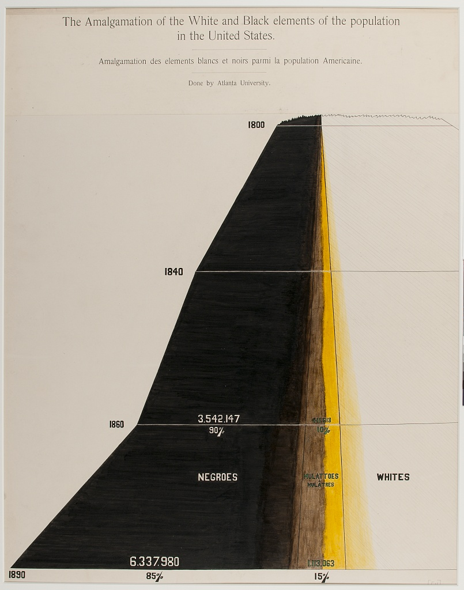

# #DuBoisChallenge2024 - Challenge 06
### Amalgamation of the White and Black elements of the population in the United States (plate 54), March 11

My contribution made with python and Canva:
![reproduction of plate 54](duboischallenge2024_06_emayola.jpg
